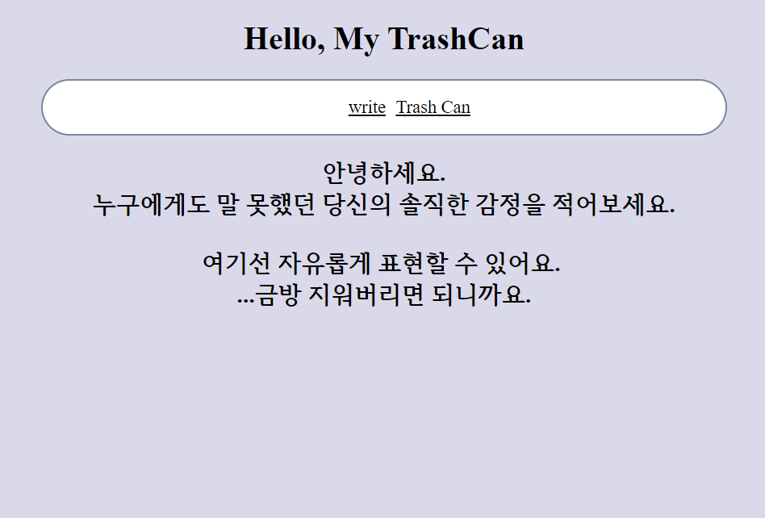
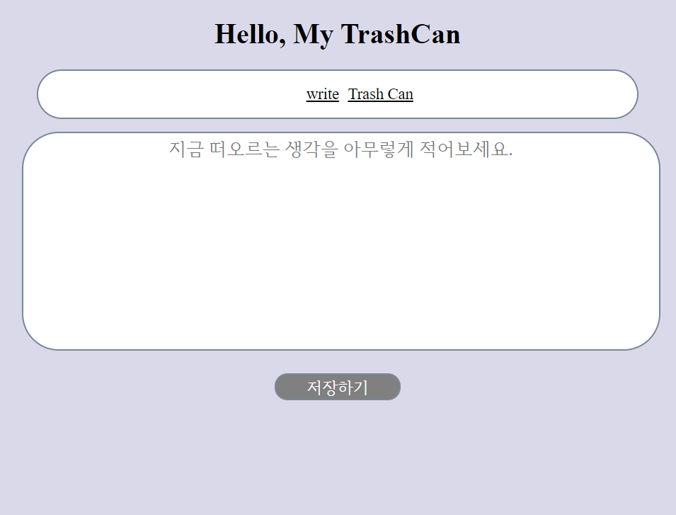
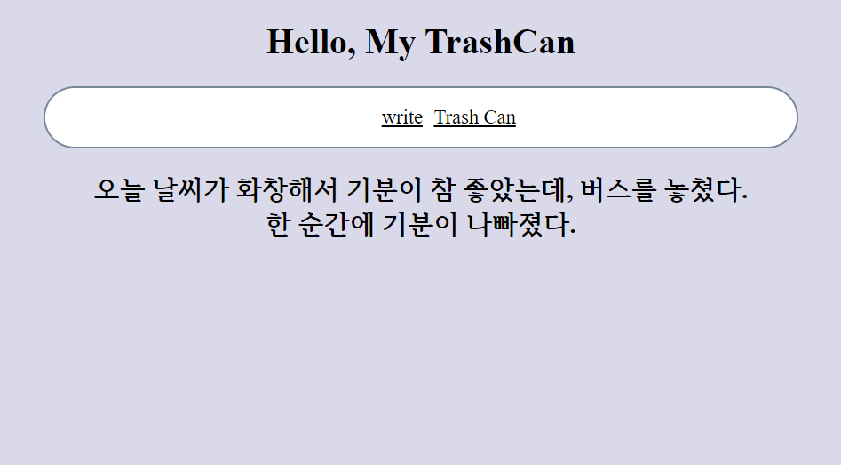
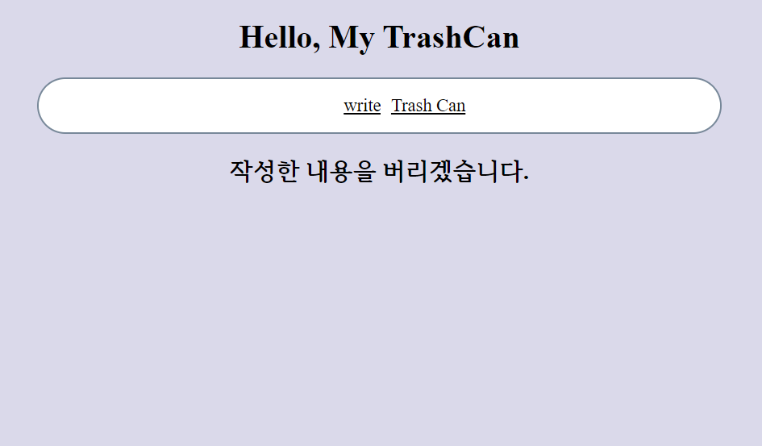
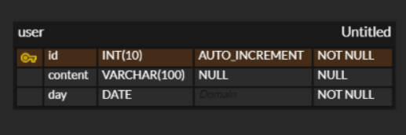

# TrashCan

you can throw your emotional garbage, miscellaneous thoughts... etc.

 

## Tech stack

➡️ Front-End : CSS, ES6, React

➡️ Back-End : Node.js

➡️ DB : MySql

 

## Screen

| Main, 메인 화면                   | Write, 작성 화면                  |
| --------------------------------- | --------------------------------- |
|  |  |
| After writing, 작성 후 화면       | TrashCan, 삭제 화면               |
|  |  |

 

 

## Trashcan 개발 개요

### Front

- 반응형 웹페이지로 제작.

> 기본적인 구성

1. 'TrashCan' 제목의 헤더 / 메뉴바 / 내용
2. 메뉴바

   - write : 작성할 수 있도록 함.
   - trashCan : 버리도록 함.

3. 내용 : default, write, read, trash 모드에 따라 바뀜.

 

### Back

1. HTTP 요청에 따라 처리 - 동기/비동기
2. ERD 
   

    

## What did I learn

### key takeaway

- axios를 통해 서버 통신하는 것 경험.
- 주요 컴포넌트를 분리하여 페이지 관리하는 법을 배움.
- node.js의 express.js를 통해 웹 서버를 띄우는 것 경험해봄.
- 클라이언트와 서버 코드 모두 작성해보며 데이터 흐름에 대해 인지하게 됨.

 

### Studying for React

This project is for studying React.
